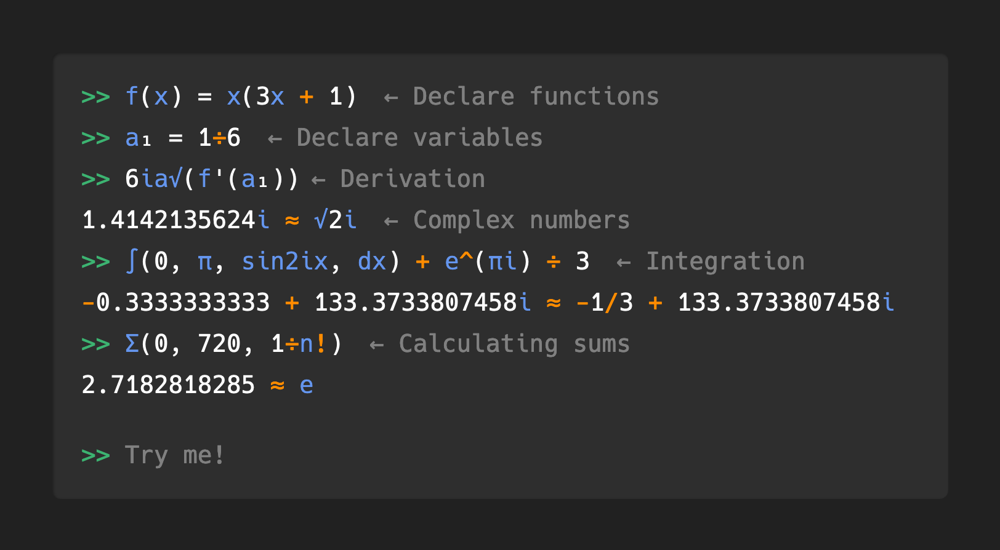

Kalker (or "kalk") is a calculator program/website that supports user-defined variables, functions, derivation, and integration. It runs on Windows, macOS, Linux, Android, and in web browsers (with WebAssembly).

    

[Kanban](https://kolan.strct.net/Board/4RAdMjLDz) | [Website - Try it out here!](https://kalker.xyz) | [Donate](#donation)

# Features

* Operators: `+`, `-`, `*`, `/`, `!`
* Groups: `()`, `⌈ceil⌉`, `⌊floor⌋`, `[iverson]`
* [Pre-defined functions and constants](https://github.com/PaddiM8/kalker/blob/master/kalk/src/prelude/mod.rs)
* User-defined functions and variables. `f(x, y) = xy`, `x = 5`
* Derivative of functions (derivatives of noisy functions or of higher order can be a bit inaccurate). `f'(2)`, `sin'(-pi)`
* Integration. `∫(0, pi, sin(x) dx)` or `∫(0, π, sin(x) dx)`, maybe sometimes be slightly off
* Understands fairly ambiguous syntax. Eg. `2sin50 + 2xy`
* Syntax highlighting
* Special-symbol completion on tab. Eg. write `sqrt` and press tab. It will be turned into `√`.
* Sum function: `sum(start, to, expression)` Eg. `sum(1, 3, 2n+1)` is the same as `2*1+1 + 2*2+1 + 2*3+1` = `15`
* Piecewise functions: `f(x) = { f(x + 1) if x <= 1; x otherwise }`, pressing enter before typing the final `}` will make a new line without submitting.
* Load a file including predefined functions and constants. For example, if you're going to use kalker for physics, you load up your file with physics functions/constants when starting kalker. `-i file`
* Misc: separate expressions by a semicolon to write them on the same line, use the `ans` variable to get the value of the previously calculated expression.

# Installation

## Package managers

### macOS
`brew install kalker`

### Arch Linux
`kalker` in the AUR, eg. `yay -S kalker`

### Nix/NixOS
Kalker is available through [`nixpkgs`](https://search.nixos.org/packages?channel=unstable&show=kalker&from=0&size=50&sort=relevance&type=packages&query=kalker).
The most up to date version is also available as a [`flake`](https://search.nixos.org/flakes?channel=unstable&show=kalker&from=0&size=50&sort=relevance&type=packages&query=kalker).

## Binaries

Pre-compiled binaries for Linux, Windows, and macOS (64-bit) are available in the [releases page](https://github.com/PaddiM8/kalker/releases).

## Compiling

**Minimum rust version: v1.36.0**. Make sure you have `diffutils` `gcc` `make` and `m4` installed. **If you use windows:** [follow the instructions here](https://docs.rs/gmp-mpfr-sys/1.2.3/gmp_mpfr_sys/index.html#building-on-windows) (don't forget to install `mingw-w64-x86_64-rust` in MSYS2).

### Cargo

Run `cargo install kalker`

### Manually

1. Go into the `cli` directory.
2. Run `cargo build --release`
3. Grab the binary from `targets/release`

# Donation

Kalker is completely free and open source. If you wish to support further development of Kalker, you can do so here: [PayPal](https://paypal.me/oliverwaldemar)

# Libraries

There are currently three different libraries related to kalker.

* [kalk](https://crates.io/crates/kalk): The Rust crate that powers it all.
* [@paddim8/kalk](https://www.npmjs.com/package/@paddim8/kalk): JavaScript bindings for `kalk`. This lets you use it in the browser thanks to WebAssembly.
* [@paddim8/kalk-component](https://www.npmjs.com/package/@paddim8/kalk-component): A web component that runs `@paddim8/kalk`, which let's you use kalk in the browser with a command line-like interface.

# Syntax

A more complete reference can be found on [the website](https://kalker.xyz)

## Functions

**Defining:** name(parameter1, parameter2, ...) = expression\
**Example:** `f(x) = 2x+3`

**Using:** name(argument1, argument2)\
**Example:** `f(2)`

## Variables

**Defining:** name = expression\
**Example:** `x = 3`

**Using:** name\
**Example:** `x`

# Contributing

## kalk and cli (Rust)

After making changes to the kalk library (in `kalk/`), you can easily try them out by going to the root of the project directory, and doing `cargo run`. This will start kalker (cli), with the new changes. If you're using Windows, you will need to [follow the instructions here](https://docs.rs/gmp-mpfr-sys/1.2.3/gmp_mpfr_sys/index.html#building-on-windows), but also make sure to install `mingw-w64-x86_64-rust` in MSYS2. 

## web (Svelte, TypeScript, Sass)

Run:
1. `npm install`  
2. `npm run dev` - this will automatically re-compile the project when changes are made

## mobile (Android)

Run:  
1. `npm install`
2. `npx cap sync`
3. Build the project using Android Studio, or Gradle directly.
